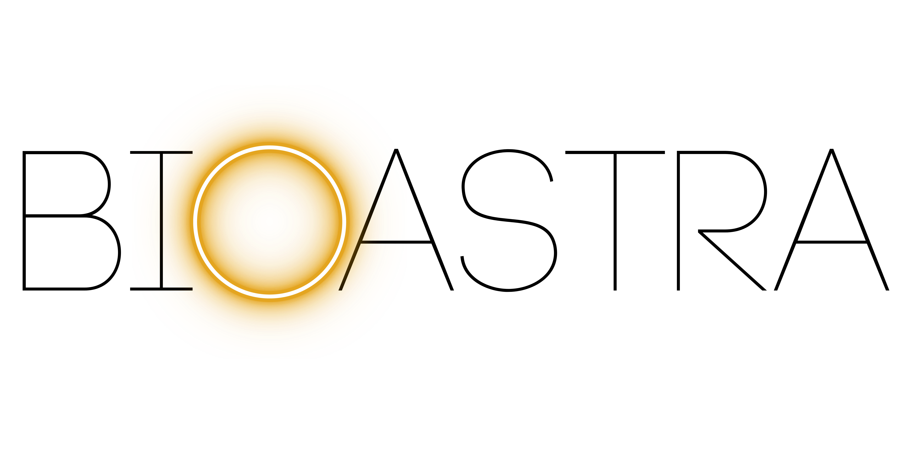
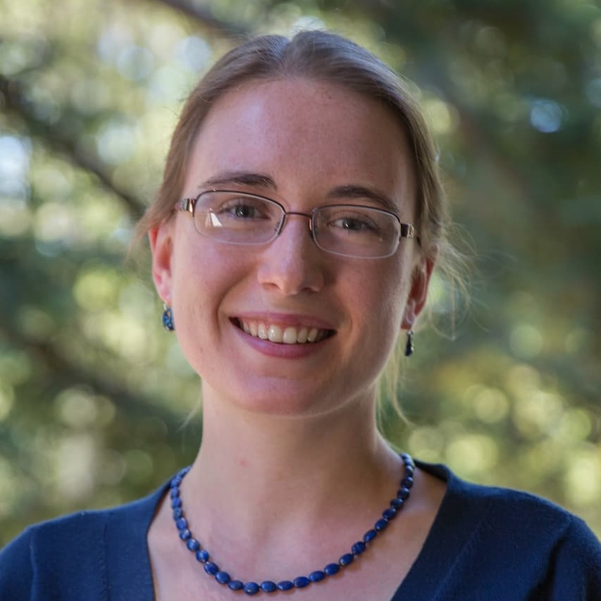
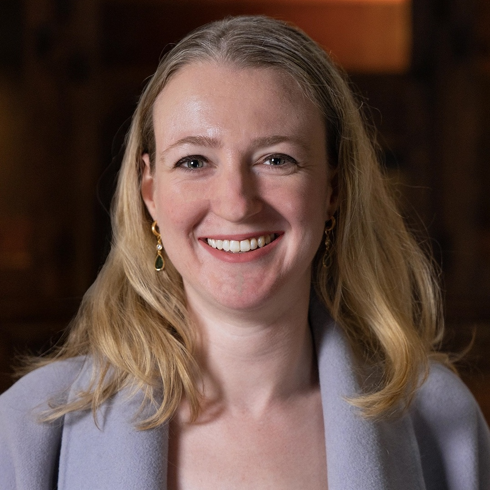
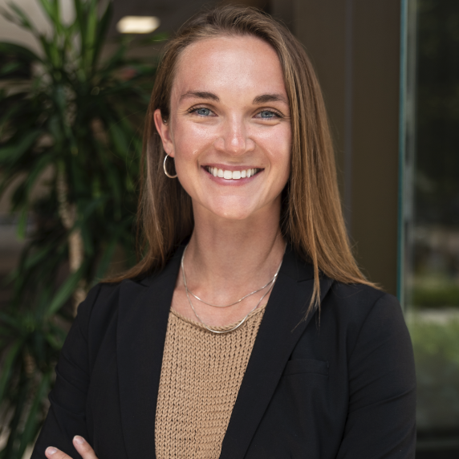
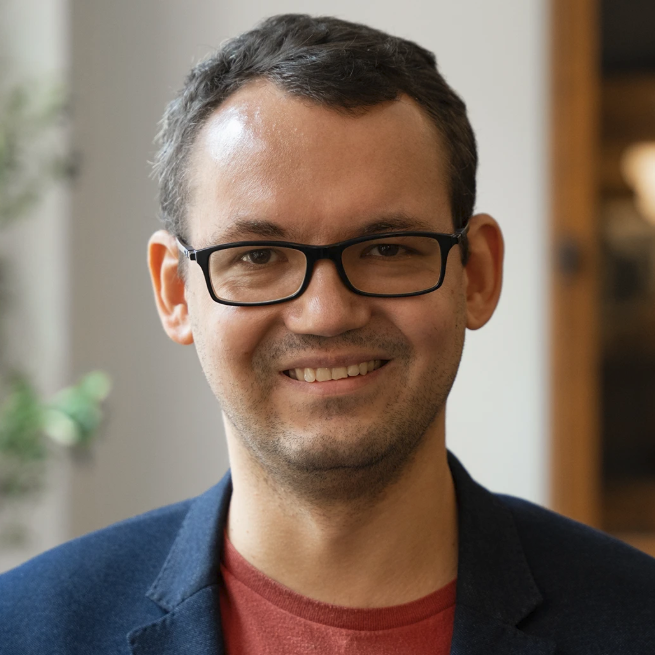
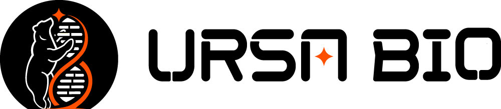
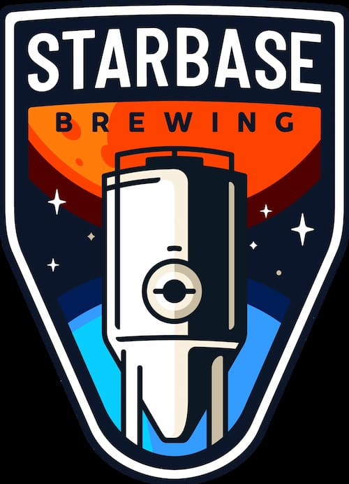

<b>Supported by</b>

<table align="center">
  <tr>
    <td align="center" valign="middle">
      
    </td>
    <td width="40"></td>
    <td align="center" valign="middle">
      
    </td>
  </tr>
</table>

# Torchlight Hackathon 2026

Welcome to the central hub for the Torchlight Summit Hackathon. This repository will be updated in real time throughout the competition.

---

## 🔔 Announcements
- All official updates will be posted here.
- Refresh this page regularly during the competition.
- This repo is the **single source of truth** during the hackathon  
- If something is unclear, check here first before asking  

Good luck — build something meaningful.
---

## ⚖️ Rules & Qualification

- Teams must complete all checkpoints (🟢) to be eligible for judging
- All submissions must be made before the final deadline
- Use only approved datasets provided

---

## 👥 Hackathon Organizers

<table style="width:100%; table-layout:fixed;">
  <tr>
    <th style="width:50%;">Lauren Sanders, PhD</th>
    <th style="width:50%;">Eliah Overbey, PhD</th>
  </tr>
  <tr>
    <td align="center">
        
      <b>Role:</b> Hackathon Organizer 
      Senior Scientist in Computational Biology, Colossal Biosciences 
      Chair of AI/ML AWG, NASA OSDR
    </td>
    <td align="center">
        
      <b>Role:</b> Summit Director 
      Assistant Professor of Bioastronautics, UATX 
      Chief Scientific Officer, BioAstra
    </td>
  </tr>
</table>

📩 **How to ask questions:**  
- Use the following Google form for all questions  
- [Question Submission](https://docs.google.com/forms/d/e/1FAIpQLSfczJWdUa-0sLF5S4oQi0TPz7Gi5CWlHEGtvRqahN6REizOkA/viewform?usp=sharing&ouid=101078977103190434418)

---

## 🧑‍💻 Competitor Directory

---

### 🔹 Team 1

| Name | Institution | Background |
|------|------------|------------|
| [Samuel M. Indyk](https://www.linkedin.com/in/samuel-indyk-b790b1272/) | University of Austin (UATX) | STEM |
| [Eitan Zarin](https://www.linkedin.com/in/eitanzarin/) | University of Austin (UATX) | STEM |

---

### 🔹 Team 2

| Name | Institution | Background |
|------|------------|------------|
| [Harris Wernick](https://www.linkedin.com/in/harris-wernick/) | University of Austin (UATX) | Data Science |
| [Hayden Proctor](https://www.linkedin.com/in/hayden-proctor-b04068349/) | University of Austin (UATX) | STEM |

---

### 🔹 Team 3

| Name | Institution | Background |
|------|------------|------------|
| [Peter Vasilik](https://www.linkedin.com/in/peter-vasilik-661aa8387/) | University of Austin (UATX) | STEM |
| [Tony Udotong](https://www.linkedin.com/in/tonyudotong/) | University of Austin (UATX) | STEM |

---

### 🔹 Team 4

| Name | Institution | Background |
|------|------------|------------|
| [Vishnu Mahesha](https://github.com/vishnumahesha) | Rouse High School / Alpha X Program | Computer Science / Programming |

---

### 🔹 Team 5

| Name | Institution | Background |
|------|------------|------------|
| [Santiago Munoz Alvarez](https://www.linkedin.com/in/santiago-munoz-alvarez) | University of Houston | Biomedical Engineering |
| [Vy Tran](https://www.linkedin.com/in/ngoc-khanh-vy-tran-928b42198) | University of Houston | Biomedical Engineering |
| [Giovanni Victorio](https://www.linkedin.com/in/giovanni-victorio) | University of Houston | Biomedical Engineering |

---

### 🔹 Team 6

| Name | Institution | Background |
|------|------------|------------|
| [Rogan Carpenter](https://www.linkedin.com/in/rogan-carpenter-a61a77406/) | University of Austin (UATX) | Biomedical Engineering |
| [Will McCollum](https://www.linkedin.com/in/will-mccollom-949293407/) | University of Austin (UATX) | Nuclear Engineering |
| [Nathaniel Freed](https://nathaniel.freedfamily.us) | University of Austin (UATX) | STEM |

---

### 🔹 Team 7

| Name | Institution | Background |
|------|------------|------------|
| [Jeremy John](https://www.linkedin.com/in/jeremy-john12/) | University of Houston | Biomedical Engineering |
| [Rohan Pandit](https://www.linkedin.com/in/rohanp06/) | Texas A&M | Computer Science |
| [Kai Mayberry](https://www.linkedin.com/in/kai-mayberry/) | Texas A&M | Applied Mathematics (Computational Science) |

---

### 🔹 Team 8

| Name | Institution | Background |
|------|------------|------------|
| [Cormac Sans](x.com/cormac_mars) | Texas A&M | Space Engineering |

---

## 🏁 Checkpoints & Deadlines

Teams must complete all required checkpoints to qualify for judging.

| Team # | 🏁 Proposal (May 7, 9PM) | 🏁 Video Log #1 (May 8, 12PM) | 🏁 Checkpoint #1 (May 8, 6PM) | 🏁 Video Log #2 (May 9, 12PM) | 🏁 Checkpoint #2 (May 9, 6PM) | 🏁 Final Submission (May 9, 4PM) |
|--------|--------------------------|-------------------------------|-------------------------------|-------------------------------|-------------------------------|----------------------------------|
| 1 |  |  |  |  |  |  |
| 2 |  |  |  |  |  |  |
| 3 |  |  |  |  |  |  |
| 4 |  |  |  |  |  |  |
| 5 |  |  |  |  |  |  |
| 6 |  |  |  |  |  |  |
| 7 |  |  |  |  |  |  |

---

### 📋 Checkpoint Requirements

#### 🏁 Proposal (May 6, 9:00 PM)
- Problem statement  
- Approach  
- Expected output  
- Private GitHub repo initialized  

#### 🏁 Video Log #1 (May 7, 12:00 PM)
- What you are building  
- Progress so far  
- Next steps / blockers  

#### 🏁 Checkpoint #1 (May 7, 6:00 PM)
- Active GitHub repo (work started)  
- Confirmed dataset + analysis direction  

#### 🏁 Video Log #2 (May 8, 12:00 PM)
- Current progress  
- Emerging insights  
- Remaining challenges  

#### 🏁 Checkpoint #2 (May 8, 6:00 PM)
- Preliminary results  
- Draft README / BioBrief structure  

#### 🏁 Final Submission (May 9, 4:00 PM) ⚠️ HARD STOP
- Public GitHub repo  
- README (BioBrief format)  
- All figures, outputs, supporting materials  

---

## 🧠 Mentor Office Hours

📍 **Zoom Link (all sessions):** [ZOOM LINK TBA]  

🔐 Passcode provided in onboarding email  
🚪 Waiting Room enabled  
⏳ Expect brief wait times if another team is currently with a mentor

| Photo | Name | Expertise | Affiliation | Time | Day |
|------|------|----------|------------|------|-----|
|  | Ricardo Vilalta, PhD | CS and AI | Professor of Computer Science, UATX | 12:00–1:00 PM CT | May 7 |
|  | Dorothy Dickmann, PhD | Data Science | Assistant Professor of Data Science, UATX | 3:00–4:00 PM CT | May 7 |
|  | Alexander Kolpakov, PhD | Math and CS | Associate Professor of Mathematics, UATX | 4:00–5:00 PM CT | May 7 |
|  | Lauren Sanders, PhD | Bioinformatics | Senior Scientist in Computational Biology | 5:00–6:00 PM CT | May 7 |

---

## 📊 Data Overview

🚧 This section will be released at the start of the competition.

All datasets, descriptions, and links to the official Google Colab notebooks will be made available at kickoff.

Please check back here once the hackathon begins.

---

## ❓ FAQ (Live Updates)

This section will be updated live throughout the competition.

📩 Questions submitted via the Google Form may be posted here if they are relevant to all teams.

Check here first before submitting a question.

**Q:**  
**A:**  

---

## Torchlight Summit

 

<b>This event is part of the <a href="https://torchlightsummit.org/">Torchlight Summit</a>.</b>

Thank you to the generous support of our summit patrons.

 

<table align="center">
  <tr>
    <td align="center" valign="middle">
      
    </td>
    <td align="center" valign="middle">
      
    </td>
    <td align="center" valign="middle">
      
    </td>
  </tr>
  <tr>
    <td align="center" valign="middle">
      
    </td>
    <td align="center" valign="middle">
      
    </td>
    <td align="center" valign="middle">
      
    </td>
  </tr>
</table>
