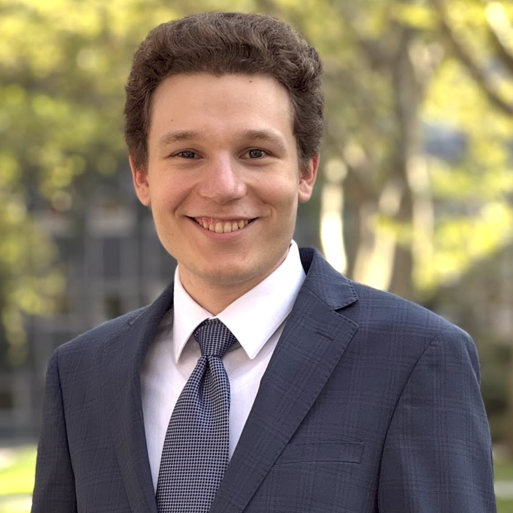

<b>Supported by</b>

<table align="center">
  <tr>
    <td align="center" valign="middle">
      
    </td>
    <td width="40"></td>
    <td align="center" valign="middle">
      
    </td>
  </tr>
</table>

# Torchlight Biosovereignty Hackathon 2026

Welcome to the central hub for the Torchlight Summit Biosovereignty Hackathon. This repository will be updated in real time throughout the competition.

---

## 🔔 Announcements
- All official updates will be posted here.
- Refresh this page regularly during the competition.
- This repo is the **single source of truth** during the hackathon  
- If something is unclear, check here first before asking  

Good luck — build something meaningful.
---

## ⚖️ Rules & Qualification

- Teams must complete all checkpoints (🟢) to be eligible for judging
- All submissions must be made before the final deadline
- Use only approved datasets provided

---

## 👥 Hackathon Organizers

<table style="width:100%; table-layout:fixed;">
  <tr>
    <th style="width:50%;">Lauren Sanders, PhD</th>
    <th style="width:50%;">Eliah Overbey, PhD</th>
  </tr>
  <tr>
    <td align="center">
        
      <b>Role:</b> Hackathon Organizer 
      Senior Scientist in Computational Biology, Colossal Biosciences 
      Chair of AI/ML AWG, NASA OSDR
    </td>
    <td align="center">
        
      <b>Role:</b> Summit Director 
      Assistant Professor of Bioastronautics, UATX 
      Chief Scientific Officer, BioAstra
    </td>
  </tr>
</table>

📩 **How to ask questions:**  
- Use the following Google form for all questions  
- [Question Submission](https://docs.google.com/forms/d/e/1FAIpQLSfczJWdUa-0sLF5S4oQi0TPz7Gi5CWlHEGtvRqahN6REizOkA/viewform?usp=sharing&ouid=101078977103190434418)

---

## 🧑‍💻 Competitor Directory

---

### 🔹 Team 1

| Name | Institution | Background |
|------|------------|------------|
| [Samuel M. Indyk](https://www.linkedin.com/in/samuel-indyk-b790b1272/) | University of Austin (UATX) | STEM |
| [Eitan Zarin](https://www.linkedin.com/in/eitanzarin/) | University of Austin (UATX) | STEM |

---

### 🔹 Team 2

| Name | Institution | Background |
|------|------------|------------|
| [Peter Vasilik](https://www.linkedin.com/in/peter-vasilik-661aa8387/) | University of Austin (UATX) | STEM |
| [Tony Udotong](https://www.linkedin.com/in/tonyudotong/) | University of Austin (UATX) | STEM |

---

### 🔹 Team 3

| Name | Institution | Background |
|------|------------|------------|
| [Vishnu Mahesha](https://github.com/vishnumahesha) | Rouse High School / Alpha X Program | Computer Science / Programming |

---

### 🔹 Team 4

| Name | Institution | Background |
|------|------------|------------|
| [Santiago Munoz Alvarez](https://www.linkedin.com/in/santiago-munoz-alvarez) | University of Houston | Biomedical Engineering |
| [Vy Tran](https://www.linkedin.com/in/ngoc-khanh-vy-tran-928b42198) | University of Houston | Biomedical Engineering |
| [Giovanni Victorio](https://www.linkedin.com/in/giovanni-victorio) | University of Houston | Biomedical Engineering |

---

### 🔹 Team 5

| Name | Institution | Background |
|------|------------|------------|
| [Rogan Carpenter](https://www.linkedin.com/in/rogan-carpenter-a61a77406/) | University of Austin (UATX) | Biomedical Engineering |
| [Will McCollum](https://www.linkedin.com/in/will-mccollom-949293407/) | University of Austin (UATX) | Nuclear Engineering |
| [Nathaniel Freed](https://nathaniel.freedfamily.us) | University of Austin (UATX) | STEM |

---

### 🔹 Team 6

| Name | Institution | Background |
|------|------------|------------|
| [Jeremy John](https://www.linkedin.com/in/jeremy-john12/) | University of Houston | Biomedical Engineering |
| [Rohan Pandit](https://www.linkedin.com/in/rohanp06/) | Texas A&M | Computer Science |
| [Kai Mayberry](https://www.linkedin.com/in/kai-mayberry/) | Texas A&M | Applied Mathematics (Computational Science) |

---

### 🔹 Team 7

| Name | Institution | Background |
|------|------------|------------|
| [Cormac Sans](x.com/cormac_mars) | Texas A&M | Space Engineering |

---

### 🔹 Team 8

| Name | Institution | Background |
|------|------------|------------|
| [Thomas Olson](https://www.linkedin.com/in/thomaslukeolson?utm_source=share_via&utm_content=profile&utm_medium=member_ios) | University of Austin (UATX) | STEM |
| Earl M. Hoffmann | University of Austin (UATX) | Mathematics |
| [Mollie Raymond](https://www.linkedin.com/in/mollie-raymond-641640332?utm_source=share_via&utm_content=profile&utm_medium=member_ios) | University of Austin (UATX) | Arts and Letters |

---
### 🔹 Team 9

| Name | Institution | Background |
|------|------------|------------|
| [Micah Briggs](https://www.linkedin.com/in/micah-briggs) | University of Austin (UATX) | STEM |
| [Samuel McClure](https://www.linkedin.com/in/sam-mcclure-b655763a6/) | University of Austin (UATX) | Economics |

---

### 🔹 Team 10

| Name | Institution | Background |
|------|------------|------------|
| [Nicole Kargin](https://www.linkedin.com/in/nicolekargin/) | University of Austin (UATX) | Bioinformatics |
| [Lucy Taylor](https://www.linkedin.com/in/lucy-taylor-8ab949392/) | University of Austin (UATX) | STEM |

---
### 🔹 Team 11

| Name | Institution | Background |
|------|------------|------------|
| Jack Crawford | University of Austin (UATX) | STEM |

---
## 🏁 Checkpoints & Deadlines

Teams must complete all required checkpoints to qualify for judging.

| Team # | 🏁 Proposal (May 6, 9PM) | 🏁 Video Log #1 (May 7, 12PM) | 🏁 Checkpoint #1 (May 7, 6PM) | 🏁 Video Log #2 (May 8, 12PM) | 🏁 Checkpoint #2 (May 8, 6PM) | 🏁 Final Submission (May 9, 4PM) |
|--------|--------------------------|-------------------------------|-------------------------------|-------------------------------|-------------------------------|----------------------------------|
| 1 | 🟢 | 🟢 |  |  |  |  |
| 2 |  |  |  |  |  |  |
| 3 | 🟢  | 🟢 | 🟢  |  |  |  |
| 4 | 🟢 | 🟢 | 🟢 | 🟢 |  |  |
| 5 | 🟢 | 🟢 | 🟢 |  |  |  |
| 6 | 🟢 | 🟢 | 🟢 | 🟢 |  |  |
| 7 | 🟢  | 🟢 | 🟢 | 🟢 |  |  |
| 8 | 🟢  | 🟢 | 🟢 | 🟢 |  |  |
| 9 |  🟢 | 🟢 | 🟢 | 🟢 |  |  |
| 10 | 🟢 | 🟢 | 🟢 | 🟢 |  |  |
| 11 |  |  |  |  |  |  |

---

### 📋 Checkpoint Requirements

[**Kickoff Slide Deck**](https://docs.google.com/presentation/d/1_M4wYlQ4xeKdqK_jV_1qHfs1vCx_23Rf/edit?usp=sharing&ouid=101078977103190434418&rtpof=true&sd=true)

[**Kickoff Video**](https://youtu.be/J56_btVCl74) 

#### 🏁 Proposal (May 6, 9:00 PM)
- Problem statement  
- Approach  
- Expected output  
- Private GitHub repo initialized  

#### 🏁 Video Log #1 (May 7, 12:00 PM)
- What you are building  
- Progress so far  
- Next steps / blockers  

#### 🏁 Checkpoint #1 (May 7, 6:00 PM)
- Active GitHub repo (work started)  
- Confirmed dataset + analysis direction  

#### 🏁 Video Log #2 (May 8, 12:00 PM)
- Current progress  
- Emerging insights  
- Remaining challenges  

#### 🏁 Checkpoint #2 (May 8, 6:00 PM)
- Preliminary results  
- Draft README / BioBrief structure  

#### 🏁 Final Submission (May 9, 4:00 PM) ⚠️ HARD STOP
- Public GitHub repo  
- README (BioBrief format)  
- All figures, outputs, supporting materials  

---

## 🧠 Mentor Office Hours

📍 **Zoom Link (all sessions):** [Zoom Link](https://weillcornell.zoom.us/j/91386845884) (passcode in your competition confirmation email)

🔐 Passcode provided in onboarding email  
⏳ Expect brief wait times if another team is currently with a mentor

| Photo | Name | Expertise | Affiliation | Time | Day |
|------|------|----------|------------|------|-----|
|  | Ricardo Vilalta, PhD | CS and AI | Professor of Computer Science, UATX | 12:00–1:00 PM CT | May 7 |
|  | Dorothy Dickmann, PhD | Data Science | Assistant Professor of Data Science, UATX | 3:00–4:00 PM CT | May 7 |
|  | Alexander Kolpakov, PhD | Math and CS | Associate Professor of Mathematics, UATX | 4:00–5:00 PM CT | May 7 |
|  | Lauren Sanders, PhD | Bioinformatics | Senior Scientist in Computational Biology | 5:00–6:00 PM CT | May 7 |
|  | Theodore Nelson, MPhil | Bioinformatics | MD-PhD Student, Weill Cornell Medicine | 2:00–4:00 PM CT | May 8 |

---

## 📊 Data Overview

All datasets are from the four crew members of the [2021 SpaceX Inspiration4 mission](https://inspiration4.com/) and are publicly available through the [NASA Open Science Data Repository (OSDR)](https://science.nasa.gov/biological-physical/data/osdr/). Samples were collected at standardized timepoints before, during, and after the 3-day spaceflight: pre-flight (L-92, L-44, L-3), in-flight (FD2, FD3), and post-flight (R+1, R+45, R+82, R+194).

### Getting Started

A starter Google Colaboratory notebook is available that loads and previews all datasets described below directly from OSDR. This gives you the correct API calls to the database to access the relevant files from each dataset, as well as reformatting commands to make the datasets analysis-ready.

🔗 **[Open the Torchlight Hackathon Notebook](https://colab.research.google.com/drive/1TAtRUU55vIulxA6P5YKFhIdohWLjLW6t?usp=sharing)**

> ⚠️ **Before using the notebook, make a copy to your own Google Drive** via File → Save a copy in Drive. Edits to the shared version will not be saved.

---

### 1. Oral, Nasal, and Skin Microbial Swabs · [OSD-572](https://osdr.nasa.gov/bio/repo/data/studies/OSD-572)

Microbial swabs collected from ten body sites (oral, nasal cavity, post-auricular, axillary vault, volar forearm, occiput, umbilicus, gluteal crease, glabella, and toe web space) at 8 timepoints (L-92, L-44, L-3, FD2, FD3, R+1, R+45, R+82). Four data files characterize the microbial communities in each swab:

| File | Description |
|------|-------------|
| KO metagenomics | Microbial function quantified by [KEGG orthology](https://www.genome.jp/kegg/ko.html) — rows are molecular functions, columns are samples |
| Taxonomy metagenomics | Microbial taxon abundance — rows are taxa, columns are samples |
| Pathway metagenomics | Molecular pathway activity — rows are pathways, columns are samples |
| Gene family metagenomics | Gene family abundance — rows are gene families, columns are samples |

---

### 2. Blood Serum Metabolic Panel · [OSD-575](https://osdr.nasa.gov/bio/repo/data/studies/OSD-575)

Serum extracted from whole blood collected via venipuncture (L-92, L-44, L-3, R+1, R+45, R+82) and submitted to Quest Diagnostics for comprehensive metabolic panel testing. Rows are metabolic measurements; columns are crew member samples.

---

### 3. Immune & Cardiac Cytokine Arrays · [OSD-575](https://osdr.nasa.gov/bio/repo/data/studies/OSD-575)

Serum from the same venipuncture collections submitted for multiplex cytokine biomarker profiling. Three panels are available:

| File | Description |
|------|-------------|
| Immune panel (Eve Technologies) | Immune cytokine biomarkers |
| Immune panel (Alamar) | Immune cytokine biomarkers from a second platform |
| Cardiovascular panel (Eve Technologies) | Cardiac cytokine biomarkers |

In each file, rows are cytokine measurements and columns are crew member samples.

---

### 4. Dragon Capsule Microbial Swabs · [OSD-573](https://osdr.nasa.gov/bio/repo/data/studies/OSD-573)

Microbial swabs from nine surfaces inside the Dragon capsule (execute button, G-meter button, left and right control touch screens, side hatch mobility aid, waste locker lid, seat 2, commode panel, viewing dome) plus an open air control. Collected twice pre-flight at the crew training capsule (L-92, L-44) and twice during flight (FD2, FD3). Same four data files as dataset 1 (KO, taxonomy, pathway, gene family), with rows as features and columns as capsule surface samples.

---

### 5. Plasma Metabolomics · [OSD-571](https://osdr.nasa.gov/bio/repo/data/studies/OSD-571)

Plasma from venous blood (L-92, L-44, L-3, R+1, R+45, R+82) used for untargeted metabolomics. Processed data reflects differential metabolite abundance comparing R+1 vs. pre-flight (L-92, L-44, L-3) using limma. Positive logFC = higher abundance post-flight. Rows are metabolites; columns are limma differential expression statistics.

---

### 6. Plasma EVP Proteomics · [OSD-571](https://osdr.nasa.gov/bio/repo/data/studies/OSD-571)

Extracellular vesicles and particles (EVPs) isolated from the same plasma collections and analyzed by mass spectrometry. Processed data reflects differential protein abundance (R+1 vs. pre-flight) using limma. Rows are proteins quantified from EVPs; columns are differential expression statistics.

---

### 7. Plasma Proteomics · [OSD-571](https://osdr.nasa.gov/bio/repo/data/studies/OSD-571)

Bulk plasma proteomics from the same collections. Differential protein abundances calculated pre vs. post-flight using limma. Rows are proteins; columns are differential expression statistics.

---

### 8. Urine Inflammation Panel · [OSD-656](https://osdr.nasa.gov/bio/repo/data/studies/OSD-656)

Urine collected pre- and post-flight (L-92, L-44, L-3, R+1, R+45, R+82). 203 inflammatory, cytokine, and chemokine proteins quantified using NULISAseq multiplex assay. Rows are crew member samples at specific timepoints; columns are protein quantifications.

---

### 9. Stool Metagenome Profiling · [OSD-630](https://osdr.nasa.gov/bio/repo/data/studies/OSD-630)

Stool collected in OMNIgene•GUT tubes pre-flight (L-92, L-44) and post-flight (R+45, R+82). Same four data files as dataset 1 (KO, taxonomy, pathway, gene family), characterizing the gut microbial community at each timepoint. Rows are features; columns are crew member stool samples.

---

### 10. Whole Blood Profiling · [OSD-569](https://osdr.nasa.gov/bio/repo/data/studies/OSD-569)

Whole blood collected via venipuncture (L-92, L-44, L-3, R+1, R+45, R+82, R+194). Three data products are available:

| File | Description |
|------|-------------|
| Total RNA sequencing | Differential gene expression (R+82 vs. pre-flight) using DESeq2. Rows are genes; columns are crew member samples. |
| m6A modification | Per-transcript m6A modification probabilities per crew member and timepoint, quantified with m6Anet. m6A is a chemical modification on mRNA that affects how transcripts are regulated, degraded, and translated — a layer of post-transcriptional regulation invisible to standard RNA-seq. Rows are gene/transcript positions; columns are per-sample modification probabilities. |
| Complete Blood Count (CBC) | Clinical cell-type counts and measurements from Quest Diagnostics at all ground timepoints. Rows are CBC measurements; columns include values, units, crew member ID, and timepoint. |

---

### 11. PBMC Profiling · [OSD-570](https://osdr.nasa.gov/bio/repo/data/studies/OSD-570)

PBMCs (peripheral blood mononuclear cells) isolated from venipuncture collections (L-92, L-44, L-3, R+1, R+45, R+82). PBMCs are the immune cells circulating in blood; profiling them reveals how the immune system is adapting or dysregulating in real time. Three data products are available:

| File | Description |
|------|-------------|
| Single-nuclei RNA-seq | Differential gene expression per cell type (R+45 vs. R+1) using Seurat FindMarkers. Rows are genes; columns are differential expression statistics. |
| Single-nuclei ATAC-seq | Differential chromatin accessibility per cell type (R+1 vs. pre-flight) using Seurat FindMarkers. Rows are genomic peaks (chr:start-end); columns are differential accessibility statistics. |
| T-cell & B-cell V(D)J profiles | TCR and BCR receptor sequences per clone, capturing immune repertoire shifts across spaceflight. Rows are individual T or B cell clones; columns include chain sequence, somatic mutations, crew member ID, and timepoint. |

---

### 12. Deltoid Skin Biopsies & Microbiome · [OSD-574](https://osdr.nasa.gov/bio/repo/data/studies/OSD-574)

Deltoid skin biopsies collected once pre-flight (L-44) and once post-flight (R+1) from four crew members pre-flight (C001–C004) and three post-flight (C002–C004). Two data products are available:

| File | Description |
|------|-------------|
| Spatial transcriptomics (NanoString GeoMx WTA) | Differential gene expression (R+1 vs. L-44) across four skin compartments: outer epidermis (OE), inner epidermis (IE), outer dermis (OD), and vasculature (VA). 18,677 genes profiled. Rows are genes; columns are differential expression statistics per skin region. |
| Deltoid skin microbiome | Metagenomic profiles from swabs taken at the biopsy site immediately before each biopsy. Same four data files as dataset 1 (KO, taxonomy, pathway, gene family). |

---

## ❓ FAQ (Live Updates)

This section will be updated live throughout the competition.

📩 Questions submitted via the Google Form may be posted here if they are relevant to all teams.

Check here first before submitting a question.

**Q: Will the judges be looking at each team's checkpoint submissions as part of scoring, or only the final GitHub?**  
**A:**  The judges will not be evaluating checkpoint submissions. Dr. Overbey and Dr. Sanders will monitor the checkpoints. Projects that pass all checkpoints will be sent to the judges, where only their final Github is evaluated.

**Q: For the proposal (and later submissions), does it have to be a more formal paragraph-style response, or would a bullet point outline work?**  
**A:**  A bullet point outline works. We are looking for evidence of progress at the proposal and other competition checkpoints.

---

## Torchlight Summit

 

<b>This event is part of the <a href="https://torchlightsummit.org/">Torchlight Summit</a>.</b>

Thank you to the generous support of our summit patrons.

 

<table align="center">
  <tr>
    <td align="center" valign="middle">
      
    </td>
    <td align="center" valign="middle">
      
    </td>
    <td align="center" valign="middle">
      
    </td>
  </tr>
  <tr>
    <td align="center" valign="middle">
      
    </td>
    <td align="center" valign="middle">
      
    </td>
    <td align="center" valign="middle">
      
    </td>
  </tr>
</table>
